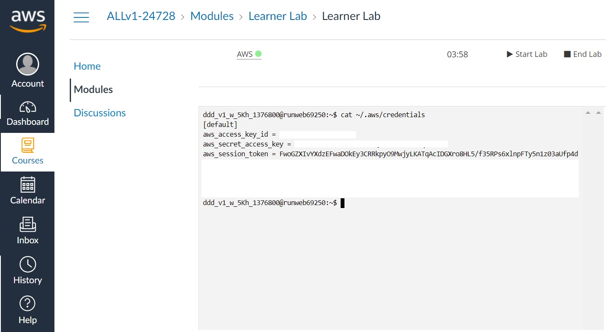
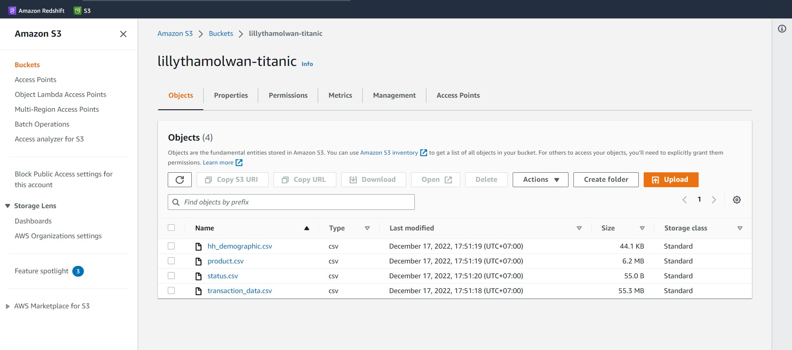
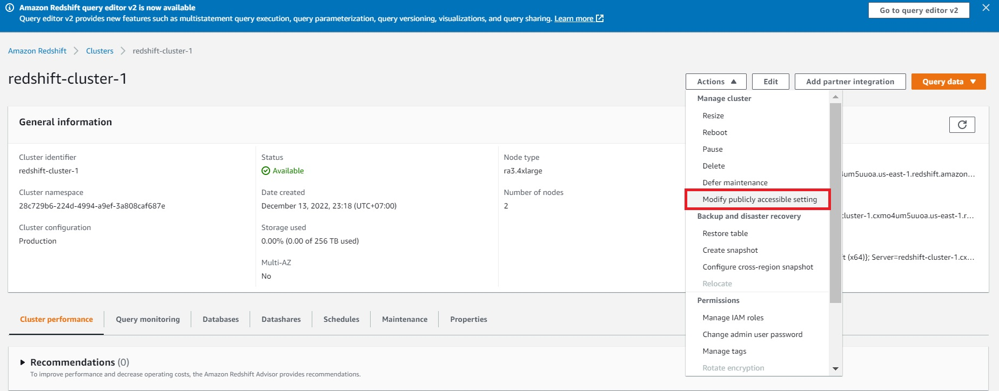
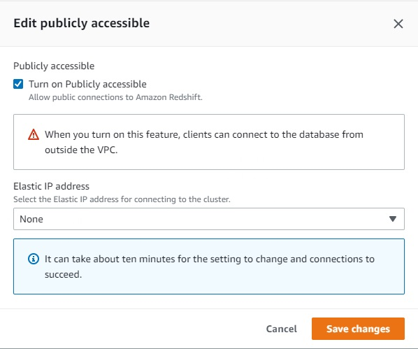

Capstone Project -> DS525 Data Warehose and Business Intelligence
1. Upload data source csv file to datalake (S3)
- open gitpod 
- Prepare environment

```sh
cd 00-capstone-project and install library boto3
python -m venv ENV
source ENV/bin/activate
pip install boto3
pip freeze
pip freeze > requirements.txt
pip install -r requirements.txt
```

- go to AWS Learner Lab และที่ Terminal ให้เราพิมพ์คำสั่ง 
 ลงไป จะได้ค่าทั้ง 3 ค่า ตามรูปด้านล่างนี้
access_key_id
secret_access_key
session_token



- go to gitpod ทำการสร้าง file main.py เพื่อเชื่อมต่อกับ S3
```sh
python main.py
```


2. สร้าง cluster บน redshift โดยต้อง turn on publicly accessible 




3. ทำการสร้างตาราง copy insert ข้อมูลไปยัง DWH  -> redshift -> ไฟล์ etl.py
```sh
python etl.py
```
ตั้งค่า profile redshift
```sh
try_redshift:
  outputs:

    dev:
      type: redshift
      threads: 1
      host: Endpoint
      port: 5439
      user: awsuser
      pass: xxxxxxxx
      dbname: dev
      schema: public

  target: dev
```

#Optional ถ้าใช้งาน dbt กับ redshift
```sh
pip install dbt-core dbt-redshift
```
สร้างโปรเจค dbt 
```sh
dbt init
```
ตั้งชื่อโปรเจคว่า : try_redshift

จากนั้นเข้าไปที่โปรเจค try_redshift
```sh
cd try_redshift
code ~/.dbt/profiles.yml
```
#Optional ทดสอบ connection คำสั่ง
  dbt debug

