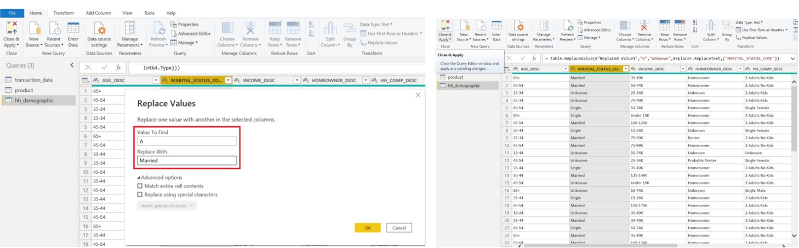
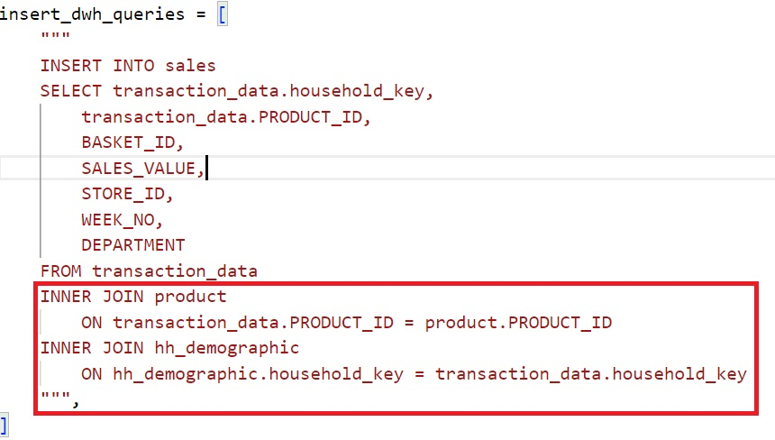
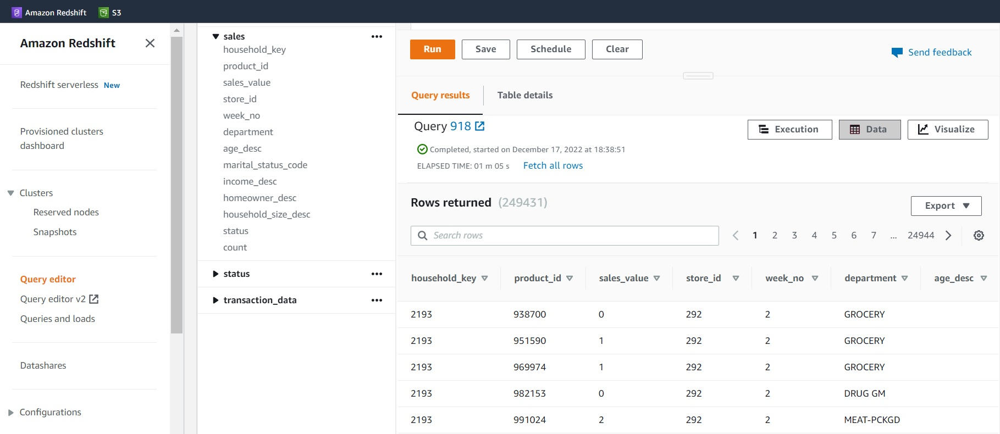
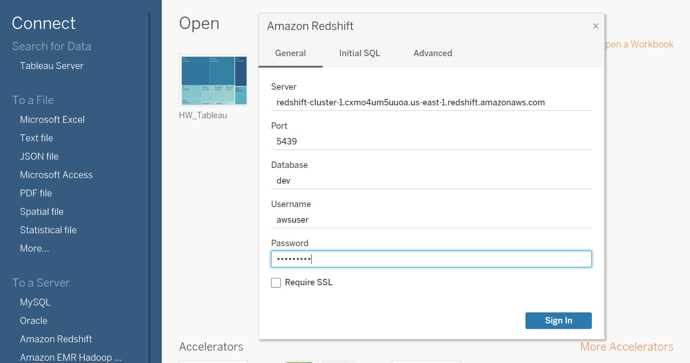
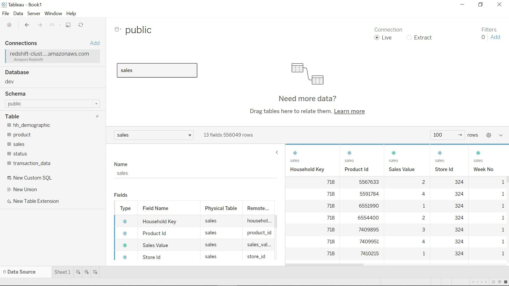

Capstone Project -> DS525 Data Warehose and Business Intelligence
1. Problem defination > ตั้งคำถามเพื่อค้นหาข้อมูลที่สนใจ

2. Data Wrangling > การสำรวจและทำความสะอาดข้อมูล 
- Use PowerBI


3. Upload data source csv file to datalake (S3)
- Open gitpod 
- Prepare environment

```sh
cd 00-capstone-project and install library boto3
python -m venv ENV
source ENV/bin/activate
pip install boto3
pip freeze
pip freeze > requirements.txt
pip install -r requirements.txt
```

- go to AWS Learner Lab และที่ Terminal ให้เราพิมพ์คำสั่ง cat ~/.aws/credentials ลงไป จะได้ค่าทั้ง 3 ค่า ตามรูปด้านล่างนี้
access_key_id
secret_access_key
session_token


- go to gitpod ทำการสร้างและรันไฟล์ main.py เพื่อเชื่อมต่อกับ Buckets ใน S3 ซึ่งเป็น Data Storage ที่สามารถจัดเก็บข้อมูลการซื้อขายจำนวนมากได้ สามารถกำหนดสิทธิให้แก่ user มีความปลอดภัยในการเข้าถึงข้อมูล Reliability น่าเชื่อถือ และมีบริการทั่วทุกมุมโลก 
```sh
python main.py
```


4. สร้าง cluster บน redshift โดยต้อง turn on publicly accessible 


5. ทำการ create table, copy, insert, Transform ข้อมูลไปยัง DWH (redshift) -> ไฟล์ etl.py


```sh
python etl.py
```
ทดสอบ query บน redshift


์Note : Redshift เป็น Data Warehouse ที่สามารถรองรับข้อมูลขนาดใหญ่ สเกลได้ และเป็น service ของ aws เช่นเดียวกับ S3 มีความสะดวกในการใช้งาน เพราะเป็นระบบฐานข้อมูลเชิงสัมพันธ์ (RDBMS) ที่ใช้ภาษา SQLในการเข้าถึงข้อมูลได้ง่าย

#Optional ถ้าใช้งาน dbt กับ redshift
```sh
pip install dbt-core dbt-redshift
```
สร้างโปรเจค dbt 
```sh
dbt init
```
ตั้งชื่อโปรเจคว่า : try_redshift
จากนั้นเข้าไปที่โปรเจค try_redshift
```sh
cd try_redshift
code ~/.dbt/profiles.yml
```
ตั้งค่า profiles
```sh
try_redshift:
  outputs:

    dev:
      type: redshift
      threads: 1
      host: Endpoint
      port: 5439
      user: awsuser
      pass: xxxxxxxx
      dbname: dev
      schema: public

  target: dev
```
#Optional ทดสอบ connection คำสั่ง
  dbt debug

6. ทำการเชื่อมต่อ redshift โดยใช้ Endpoint กับ BI Tools เช่น Tableau หรือ ดาวน์โหลดไฟล์ CSV จาก redshift เพื่อมาสร้าง Dashboard บน PowerBI



~ Ending ~