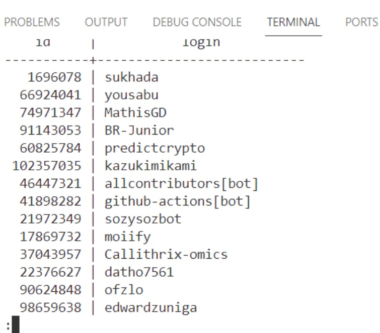

# Creating and Scheduling Data Pipelines

เข้ามาที่โฟลเดอร์ 
``` sh
cd 05-creating-and-scheduling-data-pipelines
```

ถ้าใช้งานระบบที่เป็น Linux ให้เรารันคำสั่งด้านล่างนี้ก่อน

```sh
mkdir -p ./dags ./logs ./plugins
echo -e "AIRFLOW_UID=$(id -u)" > .env
```

หลังจากนั้นให้รัน

```sh
docker-compose up
```

เราจะสามารถเข้าไปที่หน้า Airflow UI ได้ที่ port 8080
image.png
เสร็จแล้วให้คัดลอกโฟลเดอร์ `data` ที่เตรียมไว้ข้างนอกสุด เข้ามาใส่ในโฟลเดอร์ `dags` เพื่อที่ Airflow จะได้เห็นไฟล์ข้อมูลเหล่านี้ แล้วจึงค่อยทำโปรเจคต่อ

**หมายเหตุ:** จริง ๆ แล้วเราสามารถเอาโฟลเดอร์ `data` ไว้ที่ไหนก็ได้ที่ Airflow ที่เรารันเข้าถึงได้ แต่เพื่อความง่ายสำหรับโปรเจคนี้ เราจะนำเอาโฟลเดอร์ `data` ไว้ในโฟลเดอร์ `dags` เลย

สร้าง connection ที่ Airflow จากนั้นกด test เพื่อทดสอบและกด save


เขียนคำสั่งไฟล์ etl.py เพื่อสร้างชุดคำสั่ง และกำหนดช่วงเวลาในการรันคำสั่ง


Activate etl workshop


ทดสอบ query ข้อมูลตารางที่เราสร้างไว้ คำสั่งเข้าไปที่ Postgres database

```sh
psql -h localhost -d postgres -U postgres
```
พิมพ์คำสั่งแสดงชื่อตาราง
```sh
\dt
```


พิมพ์คำสั่ง query ข้อมูลตารางที่ต้องการ
```sh
select * from actors;
select * from events;
```

