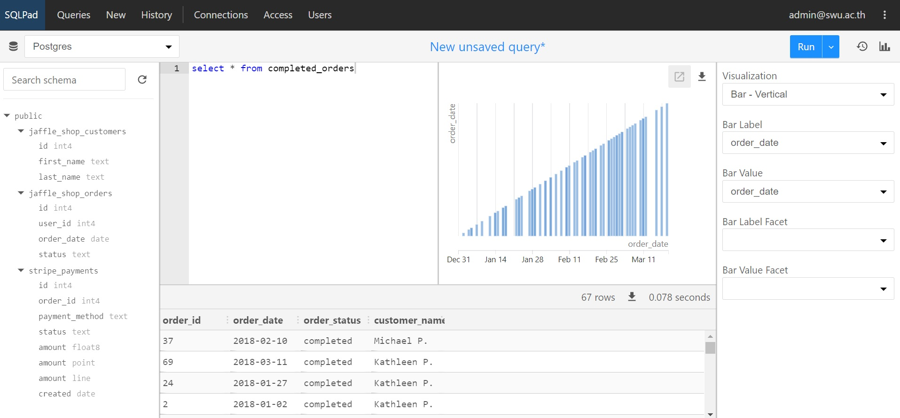
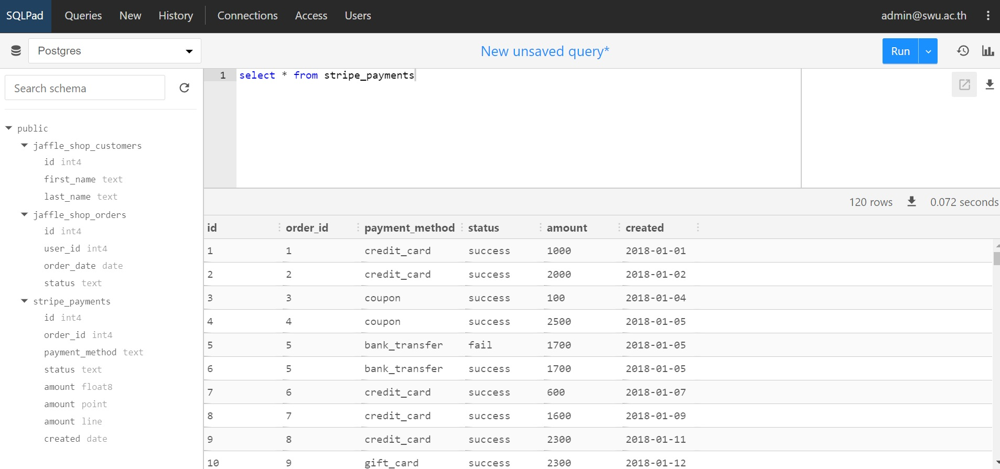
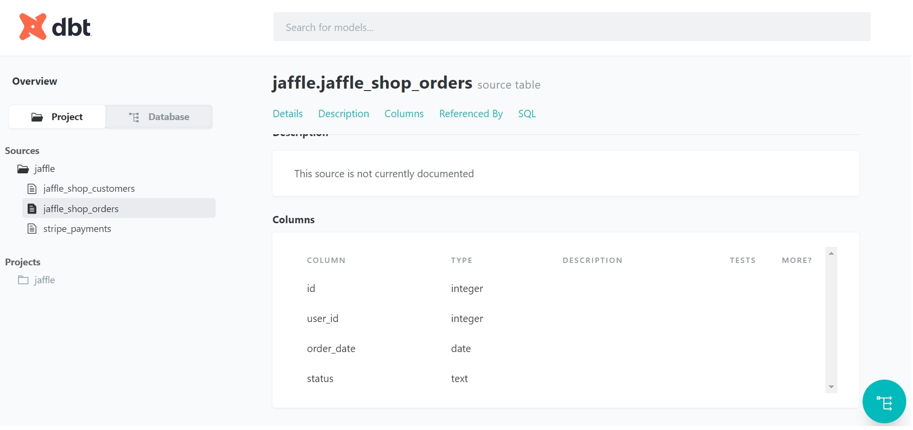
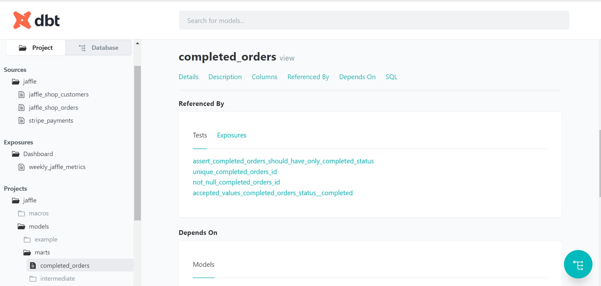
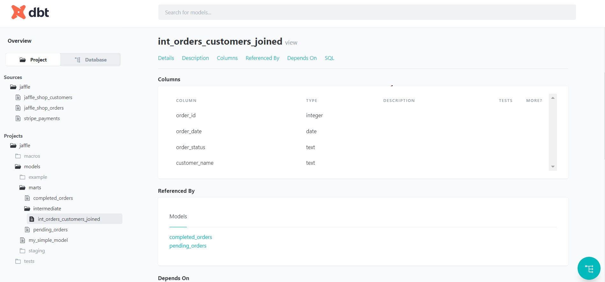
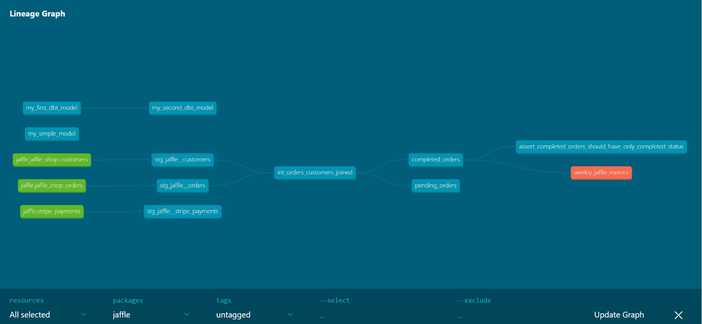

# Analytics Engineering

I. Prepare environment
เข้ามาที่
cd 06-analytics-engineering

```sh
docker-compose up
```
Open port 3000 -> SQLPad
User : admin@swu.ac.th
Pass : admin

Test Query on SQLPad


Open new terminal
cd 06-analytics-engineering
python -m venv ENV
source ENV/bin/activate
pip install -r requirements.txt

Test dbt connection # ทดสอบ connection กับ profiles

```sh
cd jaffle
dbt debug
```

mkdir -p ~/.dbt

Create a dbt project

```sh
dbt init
```

Edit the dbt profiles

```sh
code ~/.dbt/profiles.yml
```

```yml
jaffle:
  outputs:

    dev:
      type: postgres
      threads: 1
      host: localhost
      port: 5432
      user: postgres
      pass: postgres
      dbname: postgres
      schema: public

    prod:
      type: postgres
      threads: 1
      host: localhost
      port: 5432
      user: postgres
      pass: postgres
      dbname: postgres
      schema: prod

  target: dev
```

Test dbt connection # ทดสอบ connection กับ profiles

```sh
cd jaffle
dbt debug
```

You should see "All checks passed!".

ทดลองสั่ง
```sh
dbt run
```
Create folder staging/jaffle and marts

II. Set up Source
2.1 Folder staging สรา้งไฟล์ stg_jaffle__customers.sql 
-- เขียนคำสั่ง CTE => Common Table Expression เพื่อประกาศตัวแปร 
with

source as (

    select * from {{ source('jaffle', 'jaffle_shop_customers') }}

)

, final as (

    select
        id
        , first_name || ' ' || last_name as name

    from source

)

select * from final

2.2 Folder staging สรา้งไฟล์ stg_jaffle__orders.sql 
with

source as (

    select * from {{ source('jaffle', 'jaffle_shop_orders') }}

)

, final as (

    select
        id
        , user_id
        , order_date
        , status

    from source

)

select * from final

2.3 Folder staging สรา้งไฟล์ stg_jaffle__stripe_payments.sql 
with

source as (

    select * from {{ source('jaffle', 'stripe_payments') }}

)

, final as (

    select
        id
        , order_id
        , payment_method
        , status
        , amount
        , created

    from source

)

select * from final
dbt run



To create models

```sh
dbt run
```

To test models

```sh
dbt test
```

2.4 Folder staging สรา้งไฟล์ stg_models.yml สำหรับเขียน docs 

To view docs (on Gitpod)

```sh
dbt docs generate
dbt docs serve
```


3. Marts
3.1 ย้ายไฟล์ completed_orders.sql ไวใ้น marts/sales 
```sh
with
int_orders_customers_joined as (
select * from {{ ref('int_orders_customers_joined') }}
)
, final as (
select
order_id
, order_date
, order_status
, customer_name
from int_orders_customers_joined
where order_status = 'completed'
)
select * from final
```


3.2 สรา้งไฟล์ pending_orders.sql ไว้ใน marts/sales
```sh
with

int_orders_customers_joined as (

    select * from {{ ref('int_orders_customers_joined') }}

)

, final as (

    select
        order_id
        , order_date
        , order_status
        , customer_name

    from int_orders_customers_joined
    where order_status = 'pending'

)

select * from final
```
3.3 สรา้ง Folder intermediate ใน marts/sales และสรา้งไฟล์
int_orders_customers_joined.sql
```sh
with

orders as (

    select * from {{ ref('stg_jaffle__orders') }}

)

, customers as (

    select * from {{ ref('stg_jaffle__customers') }}

)

, final as (

    select
        o.id as order_id
        , o.order_date
        , o.status as order_status
        , c.name as customer_name

    from orders as o
    join customers as c
    on
        o.user_id = c.id

)

select * from final
```


3.4 สรา้งไฟล์ exposures.yml ไว้ใน marts/sales สำหรับสร้าง Dashboard 
```sh
version: 2

exposures:

  - name: weekly_jaffle_metrics
    type: dashboard
    maturity: high
    url: https://bi.tool/dashboards/1
    description: >
      My cool dashboard

    depends_on:
      - ref('completed_orders')

    owner:
      name: Kan Ouivirach
      email: kan@odds.team
  ```


3.5 ตรวจสอบไฟล์
assert_completed_orders_should_have_only_completed_status.sql ใน tests
```sh
select
status
from "postgres"."public"."completed_orders"
where status != 'completed'
